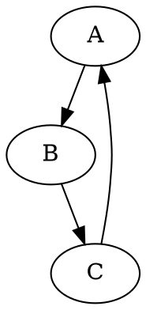
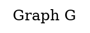
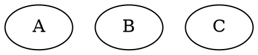
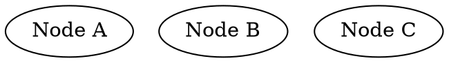
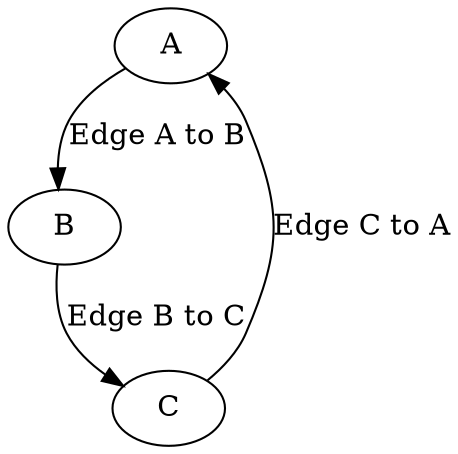
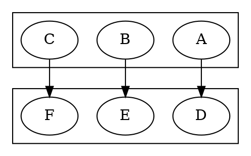
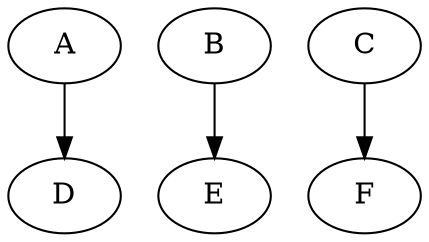

# GraphViz Cheat Sheet

## Graph

A graph is a collection of nodes and edges. It can be directed (one way) or
undirected (two way). It can also be given a label. Graphs can be declared in
two ways:

- `digraph G { A B C }` - Directed graph with nodes A, B, and C
- `graph G { A B C }` - Undirected graph with nodes A, B, and C

A directed graph is a graph where the edges have a direction. For example, if
there is an edge from A to B, then there is no edge from B to A. An undirected
graph is a graph where the edges have no direction. For example, if there is an
edge from A to B, then there is also an edge from B to A.

### Declaring Graphs

### Graph Attributes

Graphs can be given attributes which apply to all nodes and edges in the graph.
They can be declared in two ways:

OR

Some key attributes are:

- `label` - The overall title of the graph
- `rankdir` - The direction of the graph
  - `TB` - Top to bottom
  - `LR` - Left to right
  - `BT` - Bottom to top
  - `RL` - Right to left
- `splines` - The style of the edges
  - `ortho` - Orthogonal edges
  - `curved` - Curved edges
  - `line` - Straight line edges
  - `polyline` - Polyline edges
  - `spline` - Spline edges
  - `none` - No edges

## Nodes

Nodes are the elements of a graph. They can be given a label. Nodes can be
declared in two ways:

- `A` - Node A
- `A [label="Node A"]` - Node A with label "Node A"

You don't need to declare nodes before using them. You can declare them as you
use them.

### Declaring Nodes

### Node Attributes

- `label` - The label of the node
- `shape` - The shape of the node
  - For types of shapes, see [Node Shapes](#node-shapes)
- `style` - The style of the node
  - `filled` - Fill the node with color
  - `dashed` - Make the node dashed
  - `dotted` - Make the node dotted
  - `solid` - Make the node solid
  - `bold` - Make the node bold
  - `rounded` - Make the node rounded
  - `diagonals` - Make the node diagonals
- `color` - The color of the node
- `fillcolor` - The fill color of the node
- `fontcolor` - The font color of the node
- `fontsize` - The font size of the node
- `fontname` - The font name of the node
- `height` - The height of the node
- `width` - The width of the node
- `margin` - The margin of the node
- `penwidth` - The pen width of the node

## Edges

Edges are lines that connect nodes together. They can be directed (one way) or
undirected (two way). They can also be given a label. Edges can be declared in
two ways:

- `A -> B` - Directed edge from A to B
- `A -- B` - Undirected edge from A to B

A directed edge is an edge where the direction matters. For example, if there
is an edge from A to B, then there is no edge from B to A. An undirected edge is
an edge where the direction does not matter. For example, if there is an edge
from A to B, then there is also an edge from B to A.

### Declaring Edges

### Edge Attributes

## Subgraphs

Subgraphs are used to group nodes together. They create a visual boundary around
the nodes they contain. They can be declared in two ways:

- `subgraph cluster_0 { A B C }` - Subgraph with nodes A, B, and C
- `subgraph cluster_0 { A -> B -> C }` - Subgraph with edges A to B and B to C

### Using Subgraphs

## Ranks

Ranks are used to keep nodes on the same level. This is particularly useful for
directed graphs where nodes are organized in a hierarchy. Ranks can be declared
in two ways:

- `{rank=same; A; B; C}` - Rank with nodes A, B, and C at the same level
- `{rank=same; A B C}` - Rank with nodes A, B, and C at the same level

### Using Ranks

## Attribute Values

### Node Shapes

Nodes can be given different shapes with the `shape` attribute. The following
are the different shapes that can be used.

- `box` - Box shape
- `polygon` - Polygon shape
- `ellipse` - Ellipse shape
- `oval` - Oval shape
- `circle` - Circle shape
- `point` - Point shape
- `egg` - Egg shape
- `triangle` - Triangle shape
- `plaintext` - Plaintext shape
- `plain` - Plain shape
- `diamond` - Diamond shape
- `trapezium` - Trapezium shape
- `parallelogram` - Parallelogram shape
- `house` - House shape
- `pentagon` - Pentagon shape
- `hexagon` - Hexagon shape
- `septagon` - Septagon shape
- `octagon` - Octagon shape
- `doublecircle` - Doublecircle shape
- `doubleoctagon` - Doubleoctagon shape
- `tripleoctagon` - Tripleoctagon shape
- `invtriangle` - Invtriangle shape
- `invtrapezium` - Invtrapezium shape
- `invhouse` - Invhouse shape
- `Mdiamond` - Mdiamond shape
- `Msquare` - Msquare shape
- `Mcircle` - Mcircle shape
- `rect` - Rect shape
- `rectangle` - Rectangle shape
- `square` - Square shape
- `star` - Star shape
- `none` - None shape
- `underline` - Underline shape
- `cylinder` - Cylinder shape
- `note` - Note shape
- `tab` - Tab shape
- `folder` - Folder shape
- `box3d` - 3D Box
- `component` - Component shape
- `promoter` - Promoter shape
- `cds` - CDS shape
- `terminator` - Terminator shape
- `utr` - UTR shape
- `primersite` - Primersite shape
- `restrictionsite` - Restrictionsite shape
- `fivepoverhang` - Fivepoverhang shape
- `threepoverhang` - Threepoverhang shape
- `noverhang` - Noverhang shape
- `assembly` - Assembly shape
- `signature` - Signature shape
- `insulator` - Insulator shape
- `ribosite` - Ribosite shape
- `rnastab` - Rnastab shape
- `proteasesite` - Proteasesite shape
- `proteinstab` - Proteinstab shape
- `rpromoter` - Rpromoter shape
- `rarrow` - Rarrow shape
- `larrow` - Larrow shape
- `lpromoter` - Lpromoter shape

### Edge Styles

Edges can be given different styles with the `style` attribute. The following
are the different styles that can be used.

- `dashed` - Make the edge line dashed
- `dotted` - Make the edge line dotted
- `solid` - Make the edge line solid
- `bold` - Make the edge line bold
- `tapered` - Make the edge line tapered
- `invisible` - Make the edge line invisible
- `filled` - Make the edge line filled
- `striped` - Make the edge line striped
- `wedged` - Make the edge line wedged
- `diagonals` - Make the edge line diagonals

## Resources

- [GraphViz](https://graphviz.org/)
- [Sketchviz](https://sketchviz.com/)
- [Graphviz Online](https://dreampuf.github.io/GraphvizOnline/)
